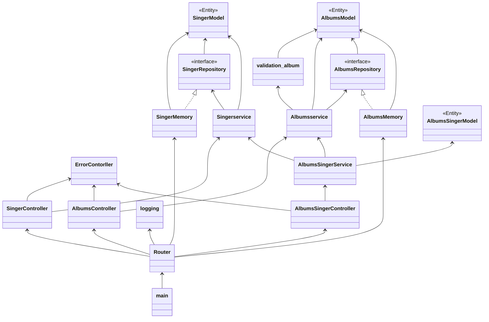

```mermaid
classDiagram

class Singerservice
class SingerRepository
class SingerModel
class SingerMemory
class SingerController
<<interface>> SingerRepository
<<Entity>> SingerModel

class validation_album
class Albumsservice
class AlbumsRepository
class AlbumsModel
class AlbumsMemory
class AlbumsController
<<interface>> AlbumsRepository
<<Entity>> AlbumsModel

class AlbumsSingerModel
<<Entity>> AlbumsSingerModel

class Router
class logging

class main
class ErrorContorller

SingerModel <-- SingerMemory
SingerRepository <|.. SingerMemory
SingerModel <-- SingerRepository
SingerModel <-- Singerservice
SingerRepository <-- Singerservice
Singerservice <-- SingerController
ErrorContorller <-- SingerController

ErrorContorller <-- AlbumsController

Albumsservice <-- AlbumsController
AlbumsRepository <-- Albumsservice
AlbumsModel <-- validation_album
validation_album <-- Albumsservice
AlbumsModel <-- Albumsservice
AlbumsModel <-- AlbumsRepository
AlbumsModel <-- AlbumsMemory
AlbumsRepository <|.. AlbumsMemory


Albumsservice <-- AlbumsSingerService
Singerservice <-- AlbumsSingerService
AlbumsSingerModel <-- AlbumsSingerService
AlbumsSingerService <-- AlbumsSingerController
ErrorContorller <-- AlbumsSingerController
AlbumsSingerController <-- Router

logging <-- Router
SingerMemory <-- Router
AlbumsMemory <-- Router
SingerController <-- Router
AlbumsController <-- Router
Router <-- main

%% AlbumsRepository <-- AlbumsSingerservice
%% AlbumsModel <-- AlbumsSingerservice
%% AlbumsSingerservice <-- AlbumsController

```